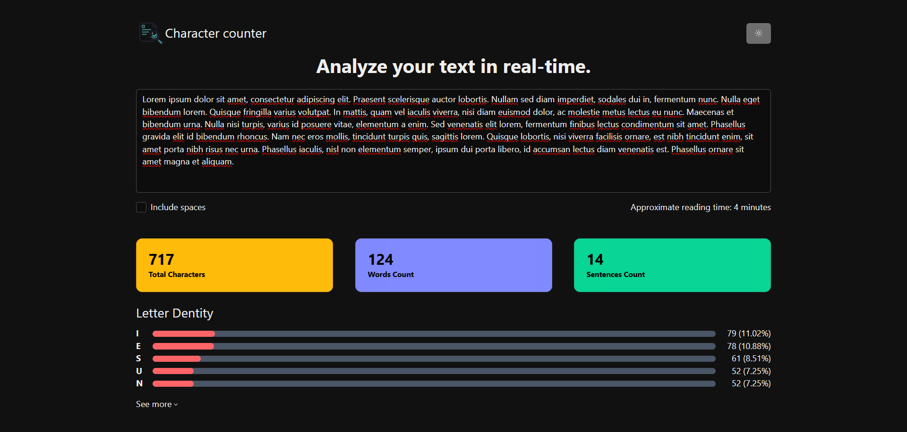
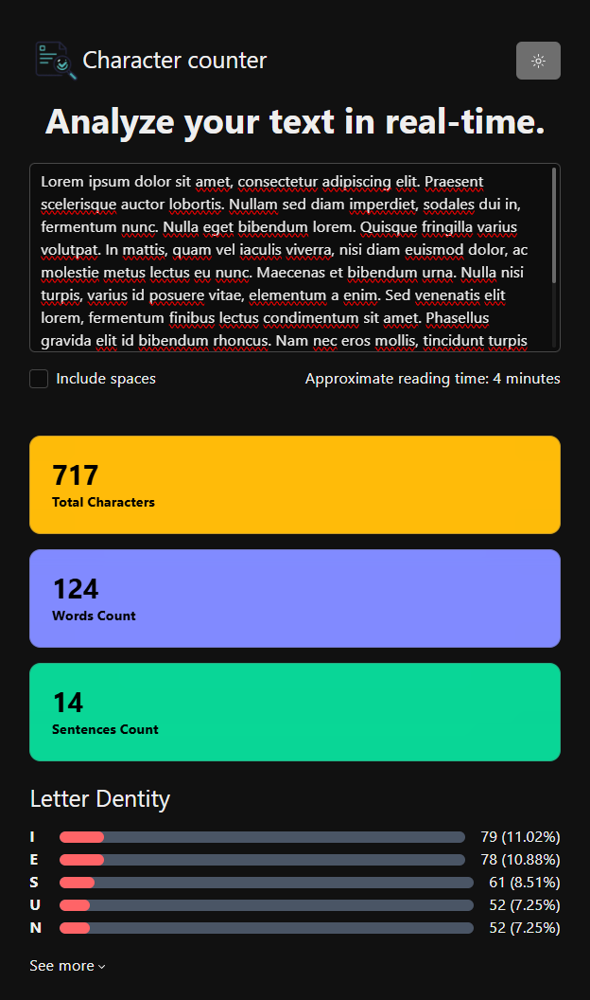
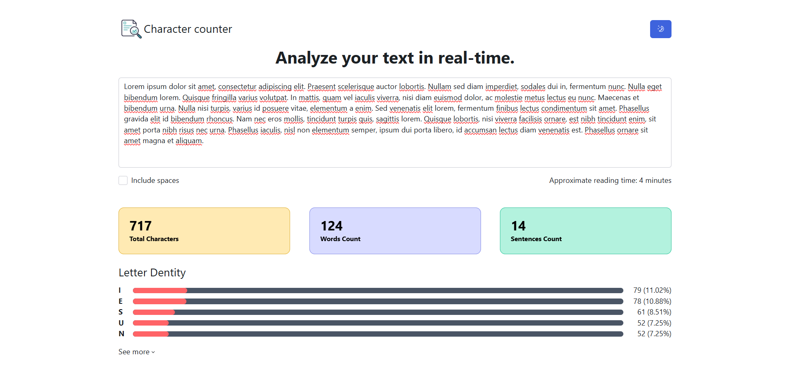
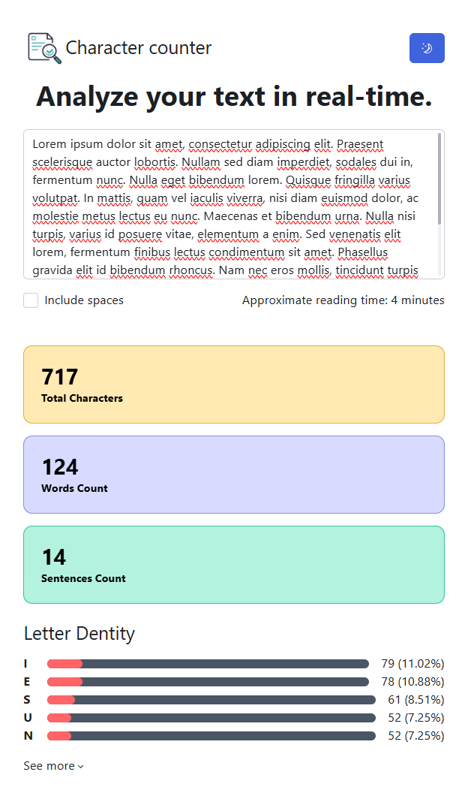

# Character Counter & Text Analyzer

A simple, real-time web application that allows users to analyze their text. It provides instant feedback on character count, word count, sentence count, and even breaks down letter density.

## 🚀 Features

- **React** – UI library
- **Vite** – Build tool
- **Zustand** – State management
- **Tailwind** – Styling
- **Radix UI** – Accessible UI

## 🛠️ Built With

- **React 19** - The latest features for UI management.
- **Vite** - Next-generation frontend tooling for a fast dev experience.
- **Zustand** - High-performance, small-footprint state management.
- **Tailwind CSS 4** - Modern utility-first styling.
- **Radix UI** - Accessible primitives for high-quality design systems.

## 📦 Installation

1.  **Clone the repo:**
    ```
    git clone https://github.com/petko-todorov/character-counter.git
    ```
2.  **Install packages:**
    ```
    npm install
    ```
3.  **Start the development server:**
    ```
    npm run dev
    ```

## 📸 Preview

Since you have added two screenshots for each mode (likely one for Desktop and one for Mobile/Responsive), it is best to stack them vertically within their respective columns.

To make them look professional, I’ve added a small spacing break (<br>) between the images and adjusted the width to 100% so they fill their table cell properly.

Markdown

## 📸 Preview

<table style="width: 100%; border: none; border-collapse: collapse;">
  <tr>
    <td align="center" style="border: none; vertical-align: top; width: 50%;">
      <strong>🌙 Dark Mode</strong>
      <br>
      
      
    </td>
    <td align="center" style="border: none; vertical-align: top; width: 50%;">
      <strong>☀️ Light Mode</strong>
      <br>
      
      <br>
      
    </td>
  </tr>
</table>
